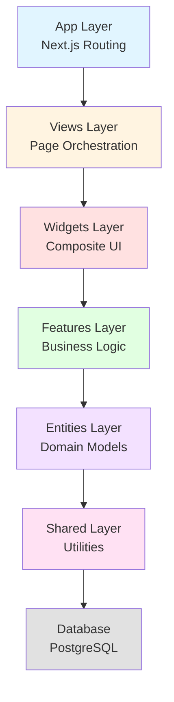
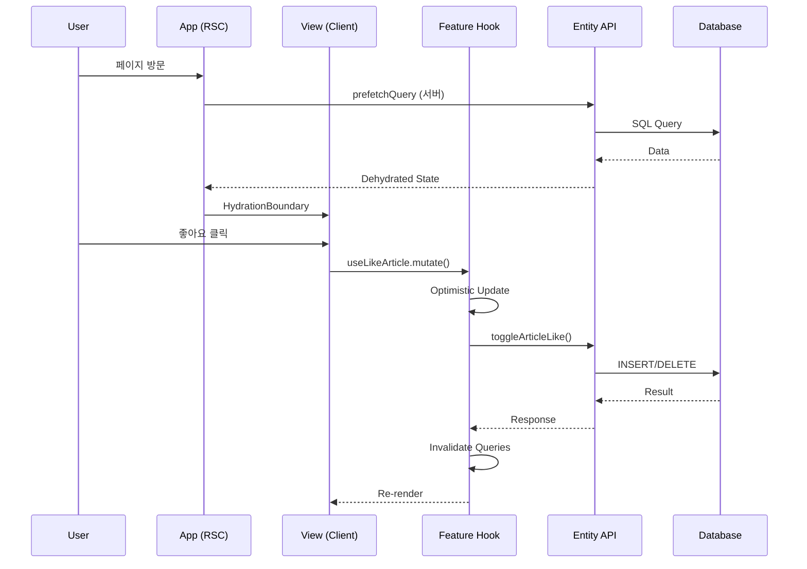

# OneLog 프로젝트 구조

## 📊 프로젝트 개요

OneLog는 **Feature-Sliced Design (FSD)** 아키텍처를 기반으로 구성된 Next.js 16 프로젝트입니다.

---

## 🏗️ 전체 디렉토리 구조

```
onelog/
├── 📁 src/                    # 소스 코드
│   ├── 📁 app/               # Next.js App Router (라우팅)
│   ├── 📁 entities/          # 비즈니스 엔티티 (CRUD)
│   ├── 📁 features/          # 비즈니스 기능 (사용자 액션)
│   ├── 📁 widgets/           # 복합 UI 컴포넌트
│   ├── 📁 views/             # 페이지 뷰 컴포넌트
│   ├── 📁 shared/            # 공유 유틸리티
│   └── 📁 db/                # 데이터베이스 (스키마, 마이그레이션)
├── 📁 docs/                   # 프로젝트 문서
├── 📁 public/                 # 정적 파일
├── 📄 package.json
├── 📄 tsconfig.json
├── 📄 next.config.ts
├── 📄 drizzle.config.ts
├── 📄 CLAUDE.md               # AI 개발 가이드
└── 📄 README.md
```

---

## 🎯 FSD 아키텍처 레이어

### 아키텍처 다이어그램



### 의존성 방향

```
App → Views → Widgets → Features → Entities → Shared → Database
(상위 레이어만 하위 레이어 참조 가능, 역방향 불가)
```

---

## 📂 상세 구조

### 1. App Layer (`src/app/`)

Next.js 16 App Router를 사용한 라우팅 레이어

```
src/app/
├── (home)/                    # 메인 페이지 Route Group
│   ├── page.tsx              # 홈 피드 (//)
│   ├── layout.tsx          # 공통 레이아웃 (사이드바)
│   ├── write/
│   │   └── page.tsx          # 게시글 작성 (/write)
│   ├── article/
│   │   └── [id]/
│   │       ├── page.tsx      # 게시글 상세 (/article/[id])
│   │       └── edit/
│   │           └── page.tsx  # 게시글 수정 (/article/[id]/edit)
│   ├── (profile)/
│   │   └── [id]/
│   │       ├── page.tsx      # 프로필 페이지 (/[id])
│   │       └── not-found.tsx # 404 페이지
│   ├── settings/
│   │   └── profile/
│   │       └── page.tsx      # 프로필 설정 (/settings/profile)
│   └── dev/
│       └── page.tsx          # 컴포넌트 프리뷰 (/dev) 🆕
├── (auth)/                    # 인증 페이지 Route Group
│   ├── layout.tsx            # 인증 전용 레이아웃
│   ├── sign_in/
│   │   └── page.tsx          # 로그인 (/sign_in)
│   └── sign_up/
│       └── page.tsx          # 회원가입 (/sign_up)
├── _store/
│   └── modal-store.ts        # 전역 모달 상태 (Zustand)
└── layout.tsx                # 루트 레이아웃
```

**주요 특징:**
- Route Groups: `(home)`, `(auth)`, `(profile)`로 레이아웃 분리
- Dynamic Routes: `[id]` 패턴 사용
- Server Components: 데이터 프리페칭
- Layout: 페이지 전환 시 애니메이션용

---

### 2. Entities Layer (`src/entities/`)

핵심 비즈니스 엔티티와 CRUD 작업

```
src/entities/
├── article/                   # 게시글 엔티티
│   ├── api/
│   │   ├── server.ts         # Server Actions (CRUD)
│   │   └── queries.ts        # TanStack Query 정의
│   ├── model/
│   │   ├── types.ts          # TypeScript 타입
│   │   ├── constants.ts      # 상수 (감정 레벨 등)
│   │   └── schema.ts         # Zod 검증 스키마
│   └── ui/
│       ├── article-header.tsx
│       ├── article-content.tsx
│       ├── article-footer.tsx
│       ├── article-like-button.tsx
│       ├── article-comment-button.tsx
│       ├── article-emotion-button.tsx
│       ├── article-access-type-button.tsx
│       ├── article-option-button.tsx
│       ├── article-report-button.tsx
│       ├── article-user-info.tsx
│       └── emotion-gauge.tsx  # 감정 레벨 시각화
├── comment/                   # 댓글 엔티티
│   ├── api/
│   │   ├── server.ts
│   │   └── queries.ts
│   ├── model/
│   │   ├── types.ts
│   │   └── constants.ts
│   └── ui/
│       ├── comment-item.tsx
│       ├── comment-form.tsx
│       └── comment-list.tsx
└── user/                      # 사용자 엔티티
    ├── api/
    │   ├── server.ts
    │   └── queries.ts
    ├── model/
    │   ├── types.ts
    │   └── constants.ts
    ├── lib/
    │   └── mappers.ts        # Supabase User → UserInfo 변환
    └── ui/
        ├── user-avatar.tsx
        ├── user-base-info.tsx
        ├── user-detail-info.tsx
        └── auth-form-field.tsx
```

**주요 특징:**
- 각 엔티티는 독립적으로 동작
- `api/`: Server Actions + TanStack Query
- `model/`: 타입, 상수, 검증
- `ui/`: 프레젠테이션 컴포넌트

---

### 3. Features Layer (`src/features/`)

사용자 액션과 비즈니스 로직

```
src/features/
├── auth/                      # 인증 기능
│   ├── api/
│   │   └── server.ts         # signIn, signUp, signOut
│   ├── lib/
│   │   ├── use-sign-in.ts    # 로그인 훅
│   │   ├── use-sign-up.ts    # 회원가입 훅
│   │   ├── use-sign-out.ts   # 로그아웃 훅
│   │   └── use-auth-guard.ts # 인증 가드 훅
│   ├── model/
│   │   ├── store.ts          # Auth Zustand Store
│   │   ├── schema.ts         # 검증 스키마
│   │   ├── types.ts
│   │   └── constants.ts
│   └── ui/
│       ├── sign-in-modal.tsx
│       ├── sign-up-modal.tsx
│       ├── sign-out-modal.tsx
│       └── auth-guard-modal.tsx
├── article/                   # 게시글 기능
│   ├── lib/
│   │   ├── use-like-article.ts      # 좋아요 (Optimistic Update)
│   │   ├── use-submit-article.ts    # 게시글 작성
│   │   ├── use-update-article.ts    # 게시글 수정
│   │   ├── use-delete-article.ts    # 게시글 삭제
│   │   └── use-report-article.ts    # 게시글 신고
│   └── ui/
│       ├── submit-article-modal.tsx
│       ├── update-article-modal.tsx
│       ├── report-article-dialog.tsx
│       └── write-page-header.tsx
├── comment/                   # 댓글 기능
│   └── lib/
│       ├── use-submit-comment.ts
│       ├── use-update-comment.ts
│       └── use-delete-comment.ts
├── user/                      # 사용자 기능
│   ├── lib/
│   │   └── use-update-profile.ts
│   └── ui/
│       └── update-profile-form.tsx
└── toggle-theme/              # 다크모드 토글
    ├── lib/
    │   └── use-theme.ts
    └── ui/
        └── toggle-theme-button.tsx
```

**주요 특징:**
- Custom Hooks: `use-*` 패턴으로 로직 캡슐화
- TanStack Query Mutations: 낙관적 업데이트
- Zustand Stores: 클라이언트 상태 관리

---

### 4. Widgets Layer (`src/widgets/`)

여러 엔티티/기능을 조합한 복합 컴포넌트

```
src/widgets/
├── article-card/              # 게시글 카드
│   └── ui/
│       └── article-card.tsx  # Article 엔티티 + Like/Comment 기능
├── article-list/              # 게시글 목록
│   └── ui/
│       └── infinite-article-list.tsx  # 무한 스크롤 리스트
├── fake-form/                 # 글쓰기 유도 폼
│   └── ui/
│       └── fake-form.tsx
└── home-page-sidebar/         # 홈 사이드바
    ├── ui/
    │   └── home-page-sidebar.tsx
    └── model/
        └── constants.ts
```

**주요 특징:**
- 엔티티 UI + 기능 훅 조합
- 재사용 가능한 복합 컴포넌트
- 페이지 간 공유

---

### 5. Views Layer (`src/views/`)

페이지별 뷰 컴포넌트 (오케스트레이션)

```
src/views/
├── home/
│   └── home-page-view.tsx           # 홈 피드 뷰
├── article/
│   └── article-detail-page-view.tsx # 게시글 상세 뷰
├── profile/
│   └── profile-page-view.tsx        # 프로필 뷰
├── write/
│   └── write-page-view.tsx          # 글쓰기 뷰
├── settings/
│   └── profile/
│       └── profile-settings-view.tsx
└── auth/
    ├── sign-in-page-view.tsx
    └── sign-up-page-view.tsx
```

**주요 특징:**
- Client Components
- Widgets + Features 조합
- TanStack Query `useSuspenseQuery` 사용

---

### 6. Shared Layer (`src/shared/`)

프레임워크 독립적인 공유 코드

```
src/shared/
├── components/
│   ├── ui/                           # shadcn/ui 컴포넌트
│   │   ├── button.tsx
│   │   ├── badge.tsx
│   │   ├── card.tsx
│   │   ├── input.tsx
│   │   ├── textarea.tsx
│   │   ├── avatar.tsx
│   │   ├── dialog.tsx
│   │   ├── dropdown-menu.tsx
│   │   ├── popover.tsx
│   │   ├── tooltip.tsx
│   │   ├── hover-card.tsx
│   │   ├── progress.tsx
│   │   ├── separator.tsx
│   │   ├── select.tsx
│   │   ├── label.tsx
│   │   ├── form.tsx
│   │   ├── field.tsx
│   │   ├── spinner.tsx
│   │   ├── skeleton.tsx
│   │   ├── sonner.tsx (toast)
│   │   ├── sidebar.tsx
│   │   └── sheet.tsx
│   ├── center-container.tsx
│   ├── header-container.tsx
│   ├── page-container.tsx
│   ├── sidebar-container.tsx
│   ├── modal-container.tsx
│   └── transition-container.tsx
├── lib/
│   ├── supabase/
│   │   ├── server.ts                # Server-side Supabase client
│   │   ├── client.ts                # Client-side Supabase client
│   │   └── storage.ts               # File upload utilities
│   ├── tanstack/
│   │   └── get-query-client.ts      # TanStack Query client
│   └── utils.ts                     # cn() helper
├── hooks/
│   ├── use-debounce.ts
│   └── use-intersection-observer.ts
├── model/
│   ├── constants.ts                 # 전역 상수
│   └── types.ts                     # 전역 타입
└── provider/
    ├── query-provider.tsx           # TanStack Query Provider
    ├── theme-provider.tsx           # next-themes Provider
    └── modal-provider.tsx           # Modal Portal
```

**주요 특징:**
- shadcn/ui 기반 디자인 시스템
- Supabase/TanStack Query 설정
- 재사용 가능한 유틸리티

---

### 7. Database Layer (`src/db/`)

데이터베이스 스키마 및 마이그레이션

```
src/db/
├── schemas/
│   ├── articles.ts                  # 게시글 테이블
│   ├── article-likes.ts             # 좋아요 테이블
│   ├── comments.ts                  # 댓글 테이블
│   ├── profiles.ts                  # 프로필 테이블
│   └── reports.ts                   # 신고 테이블
├── migrations/                      # Drizzle 마이그레이션
│   ├── meta/
│   └── 0000_melted_the_fallen.sql
├── policies/                        # RLS 정책
│   └── rls-policies.sql
├── index.ts                         # DB 연결
└── seed.ts                          # 시드 데이터
```

**주요 특징:**
- Drizzle ORM
- PostgreSQL (Supabase)
- Row Level Security (RLS)

---

## 🔄 데이터 플로우

### 전체 흐름도



### 예시: 게시글 좋아요

```
1. User clicks "좋아요" button
   ↓
2. ArticleCard (Widget) → onClick callback
   ↓
3. HomePageView (View) → useLikeArticle hook
   ↓
4. useLikeArticle (Feature)
   → Optimistic UI update (즉시 반영)
   → toggleArticleLike (Entity Server Action)
   ↓
5. toggleArticleLike (Entity API)
   → Drizzle ORM query
   → PostgreSQL database
   ↓
6. Response
   → TanStack Query cache invalidation
   → UI auto re-render
```

---

## 📊 프로젝트 통계

### 파일 구성

| 레이어 | 디렉토리 수 | 파일 수 (예상) | 주요 역할 |
|--------|------------|---------------|----------|
| **App** | 8 | ~15 | 라우팅, 데이터 프리페칭 |
| **Entities** | 9 | ~32 | 도메인 모델, CRUD |
| **Features** | 10 | ~25 | 비즈니스 로직 |
| **Widgets** | 4 | ~6 | 복합 UI |
| **Views** | 6 | ~10 | 페이지 뷰 |
| **Shared** | 8 | ~35 | 공유 유틸리티 |
| **Database** | 4 | ~10 | 스키마, 마이그레이션 |

### 기술 스택 버전

```json
{
  "next": "16.0.1",
  "react": "19.2.0",
  "drizzle-orm": "^0.44.7",
  "@tanstack/react-query": "^5.90.5",
  "zustand": "^5.0.8",
  "zod": "^4.1.12",
  "tailwindcss": "^4"
}
```

---

## 🎨 명명 규칙

### 파일 & 폴더

- **파일명**: kebab-case (예: `use-like-article.ts`)
- **폴더명**: kebab-case (예: `article-card/`)
- **컴포넌트**: PascalCase 함수명 (예: `ArticleCard`)

### 코드

- **Server Actions**: `"use server"` 지시어
- **Client Components**: `"use client"` 지시어
- **Custom Hooks**: `use-*` 접두사
- **Types**: `PascalCase` (예: `ArticleWithAuthorInfo`)
- **Constants**: `UPPER_SNAKE_CASE` (예: `ARTICLE_QUERY_KEY`)

---

## 🔗 레이어 간 의존성 규칙

### ✅ 허용

```typescript
// App → Views
import { HomePageView } from "@/views/home/home-page-view";

// Views → Widgets
import { ArticleCard } from "@/widgets/article-card/ui/article-card";

// Widgets → Features
import { useLikeArticle } from "@/features/article/lib/use-like-article";

// Features → Entities
import { toggleArticleLike } from "@/entities/article/api/server";

// 모든 레이어 → Shared
import { Button } from "@/shared/components/ui/button";
```

### ❌ 금지

```typescript
// Entities → Features (역방향)
import { useLikeArticle } from "@/features/article/lib/use-like-article"; // ❌

// Shared → Entities (상위 참조)
import { Article } from "@/entities/article/model/types"; // ❌

// Features → App (순환 참조)
import { HomePage } from "@/app/(home)/page"; // ❌
```

---

## 📝 개발 워크플로우

### 새 기능 추가 시

1. **Entity 정의** (`entities/`)
   - DB 스키마 작성
   - Server Actions 작성
   - Query 정의
   - 타입 & 상수 정의

2. **Feature 구현** (`features/`)
   - Custom Hook 작성 (useMutation)
   - UI 컴포넌트 작성 (Modal 등)

3. **Widget 조합** (`widgets/`)
   - Entity UI + Feature Hook 조합
   - 재사용 가능한 복합 컴포넌트

4. **View 구성** (`views/`)
   - Widgets 배치
   - 페이지 레벨 로직

5. **Route 연결** (`app/`)
   - 라우트 생성
   - 서버 데이터 프리페칭

---

## 🔍 주요 진입점

### 개발

```bash
bun dev              # http://localhost:3000
bun dev              # http://localhost:3000/dev (컴포넌트 프리뷰)
```

### 데이터베이스

```bash
bun db:generate      # 마이그레이션 생성
bun db:push          # 스키마 푸시 (개발)
bun db:migrate       # 마이그레이션 실행 (프로덕션)
bun db:seed          # 시드 데이터
```

### 코드 품질

```bash
bun lint             # Biome 린트
bun format           # 코드 포맷팅
```

---

## 📚 관련 문서

- [프로젝트 기획안](./project-proposal.md)
- [기술 스택 상세](./tech-stack-overview.md)
- [개발 가이드](../CLAUDE.md)
- [README](../README.md)

---

**작성일**: 2025-01-10
**버전**: 1.0
**작성자**: Claude Code